# Project 1

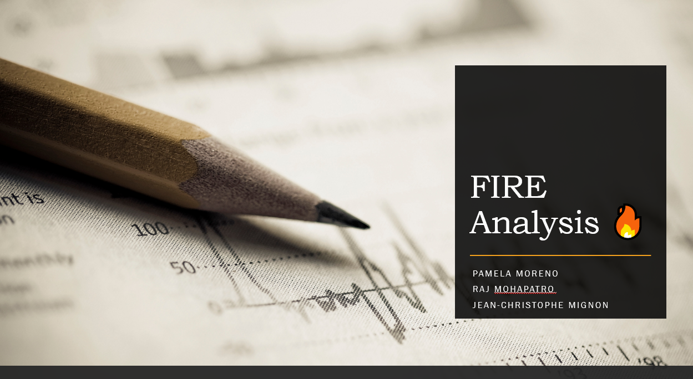

## Summary
____

James is keen to retire early, based on the FIRE principle. He’d like to assess based on his age, savings and lifestyle what that would look like. Unfortunately, James will have to work a long time to reach Financially Independent Retire Early status. 

A wise person suggests James to invest on the stock exchange, to speed up the process. James would like to see some proof of what that would look like. A brilliant tool is shown to James, which has  10, 20 and 30 year return simulations including risk assessment. 

James, is also thinking that if he could save a bit of money on cost living, he would end up with more and having a good retirement life. So for that, James would like to analysis the cost living expenses in different countries and see if he better off moving into another country.

## Questions:

1. Could James achieve FIRE status? 

2. Are there ways to speed up the process? 

3. What would be an alternative investment strategy for retirement plan?

4. Would the Market be a good alternative for investment and what would be its risk?

5. How much returns would you have if investing into the Market over next 10, 20 & 30 years?

6. Could a new relocation be a good option to save more money?

7. What would the more affordable places?

8. What location can I afford based on my savings? 

## Data:

### - FIRE calculator

* Input personal data in the calculator

### - Market Analysis & Retirement Tool Data: 
We used yfinance to fetch historical data of 5 major Indexes market. We used then https://au.finance.yahoo.com/ and collected the data history of S&P500, NASDAQ Composite, S&P/ASX 200, Dow Jones Commodity & BTC.

### Indexes:

1. S&P500 (GSPC). 
2. NASDAQ Composite (IXIC). 
3. S&P/ASX 200 (ASX). 
4. DJCI (Dow Jones Commodity)
5. BTC.

## Analysis
___

### - FIRE calculator

#### Current Path to FIRE:

#### FIRE Path if invested:

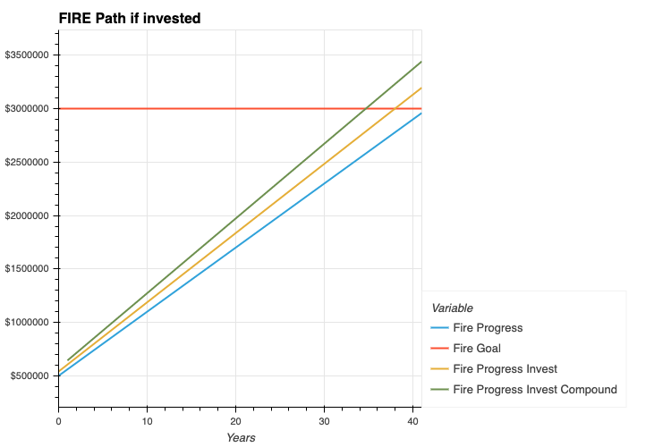

#### Suggested FIRE path:

### - Market Analysis: 

#### We have analysed these major indexes to determine their performance in multiple areas: volatility, returns, risk, and Sharpe ratios 

#### Initial Data:

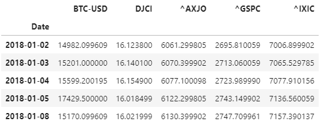

#### Daily Returns: 

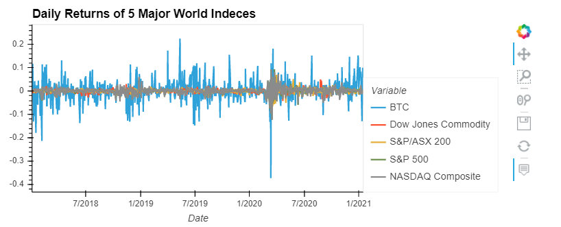

#### Cumulative Returns:
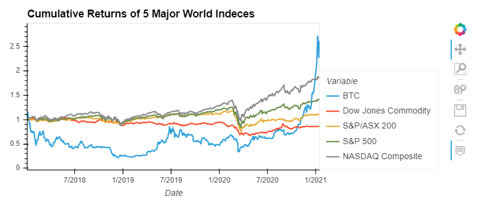

#### Risk Analysis -> Standard Deviation:
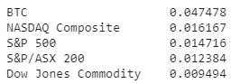

#### Sharpe Ratios:
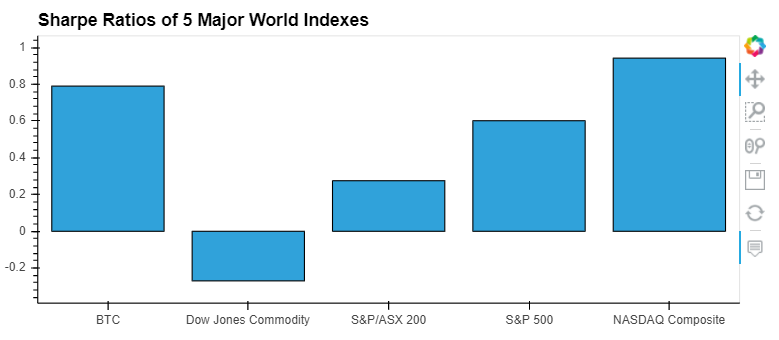

### Retirement Plan Tool Analysis:

#### We have used Monte Carlo simulations to project our 5 Indexes Market in 10-, 20- & 30-years.

#### Then, we analysed the statistics from the simulated daily returns in 10-, 20- & 30-years to determine the returns based on an innitial investment of $20,000 and annual investment of $10,000.

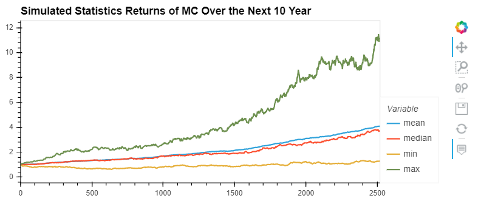
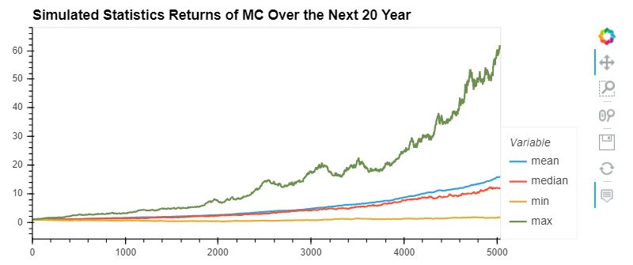
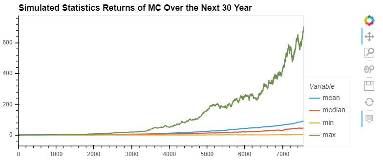

### Final Returns:
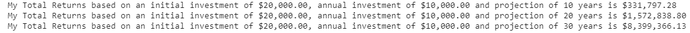

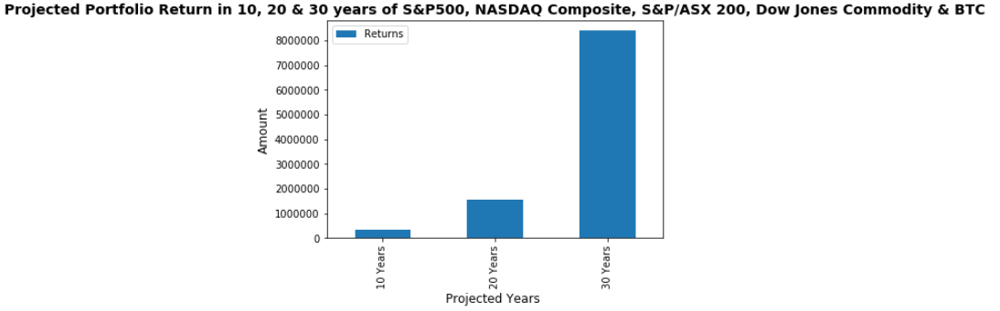

## Cost of Living Analysis:
### Cost of living returns the list of countries a person is eligible to retire base on his expected savings and age.Cost of living analysis pulls per capita income data from worldbank using wbdata. Then it derives the cost of living per country for next 50 years. From that data it derives the list countries a person would be eligible after certain age. Using geopy and Nomatin the country cordinates are retrieved and you folin the visualization has been done
####
___
## Coutries for retirement
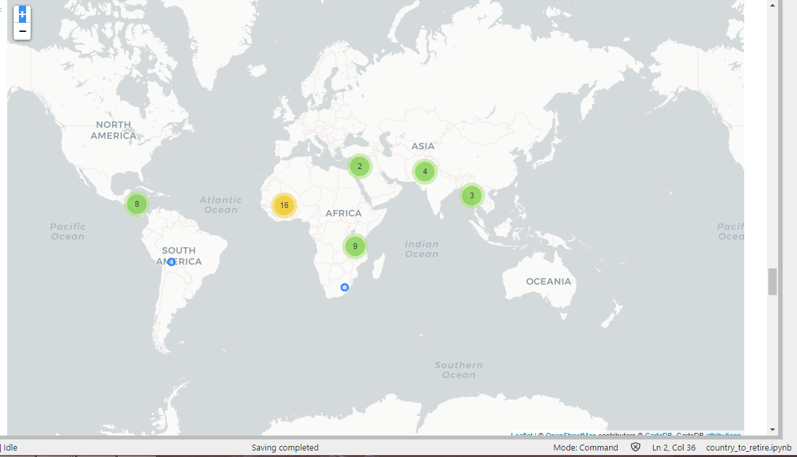
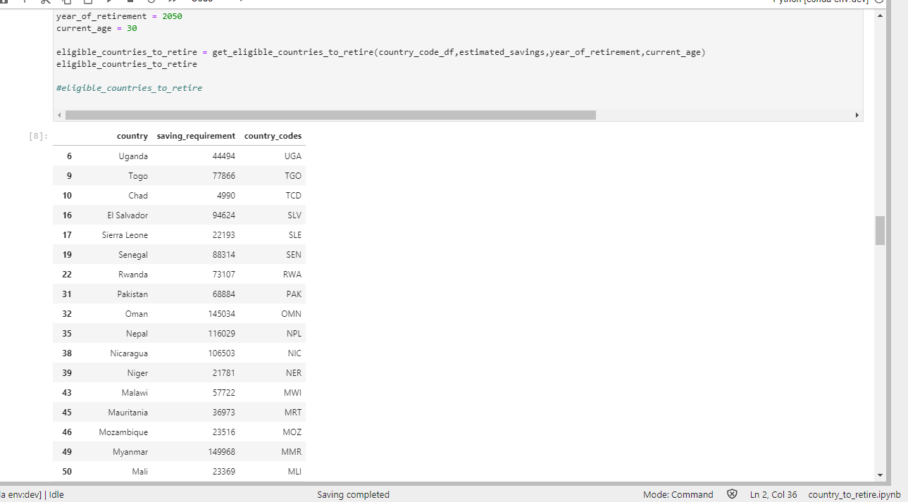

