# Project 1

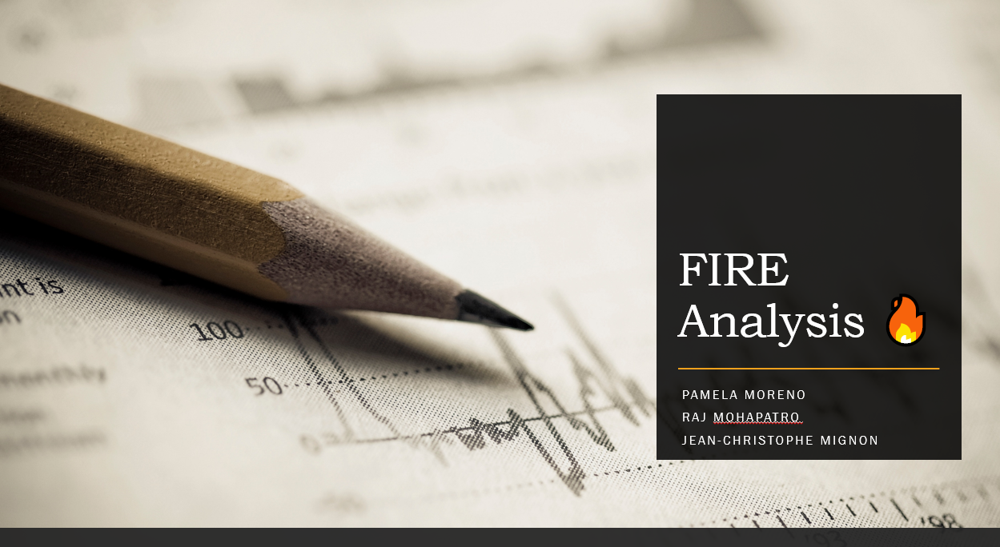

## Summary
____
James an average person is looking to see if there is an alternative option that he can retire earlier based on his age, savings and lifestyle.

James has done some calculations on his Superfund, but has found that, it will take a lot of time to achieve his goal, so he decided to look out for an alternative investment strategy.

James is whiling to take some risk and would like to see if investing into the Market would help him to achieve his goal. He would like then to use a tool that can predict him how he would end up in the next 10, 20 and 30 years based on an initial investment and savings every year.

James, is also thinking that if he could save a bit of money on cost living, he would end up with more and having a good retirement life. So for that, James would like to analysis the cost living expenses in different countries and see if he better off moving into another country.

## Questions:

1. When would you like to retire?

2. If you would like to retire sooner, would Superannuation be the best retirement plan?

3. What would be an alternative investment strategy for retirement plan?

4. Would the Market be a good alternative for investment and what would be its risk?

5. How much returns would you have if investing into the Market over next 10, 20 & 30 years?

6. Could a new relocation be a good option to save more money?

7. What would the more affordable places?

8. What location can I afford based on my savings? 

## Data:

### - Personal Analysis Data: (JC)

### - Market Analysis & Retirement Tool Data: 
We used yfinance to fetch historical data of 5 major Indexes market. We used then https://au.finance.yahoo.com/ and collected the data history of S&P500, NASDAQ Composite, S&P/ASX 200, Dow Jones Commodity & BTC.

### Indexes:

1. S&P500 (GSPC). 
2. NASDAQ Composite (IXIC). 
3. S&P/ASX 200 (ASX). 
4. DJCI (Dow Jones Commodity)
5. BTC.

### - Cost of living analysis Data:  (Raj) 

## Analysis
___

### - Personal Analysis Data: (JC)

### - Market Analysis: 

#### We have analysed these major indexes to determine their performance in multiple areas: volatility, returns, risk, and Sharpe ratios 

#### Initial Data:

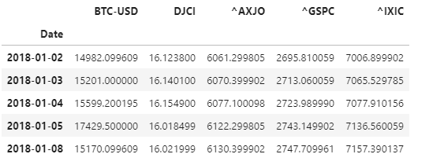

#### Daily Returns: 

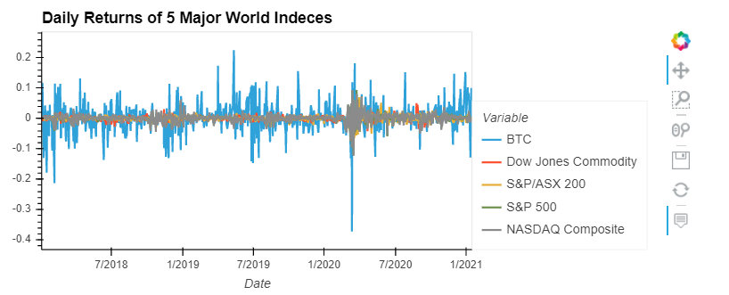

#### Cumulative Returns:
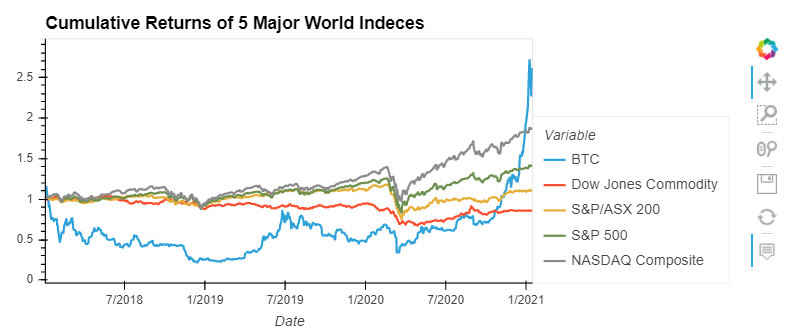

#### Risk Analysis -> Standard Deviation:
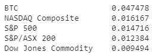

#### Sharpe Ratios:
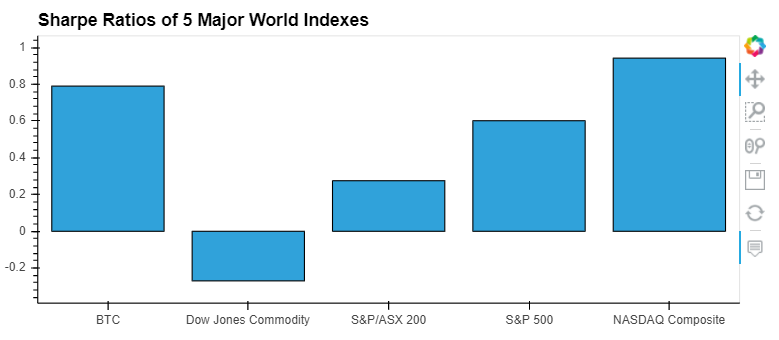

### Retirement Plan Tool Analysis:

#### We have used Monte Carlo simulations to project our 5 Indexes Market in 10-, 20- & 30-years.

#### Then, we analysed the statistics from the simulated daily returns in 10-, 20- & 30-years to determine the returns based on an innitial investment of $20,000 and annual investment of $10,000.

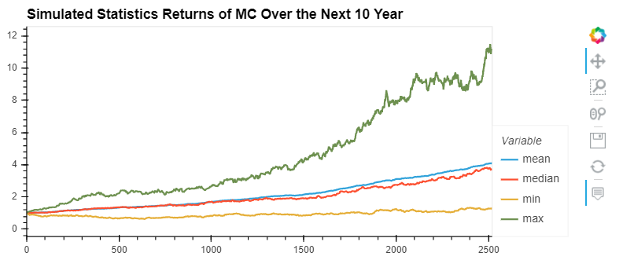
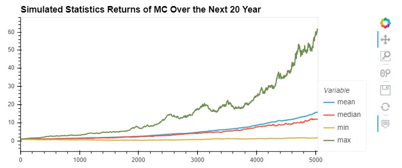
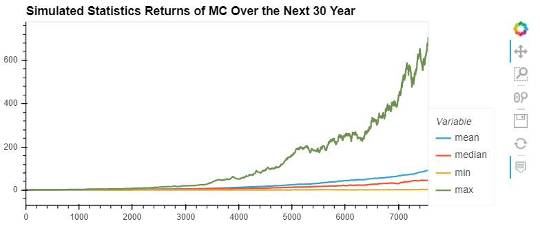

### Final Returns:
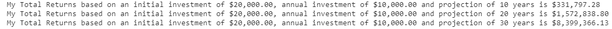

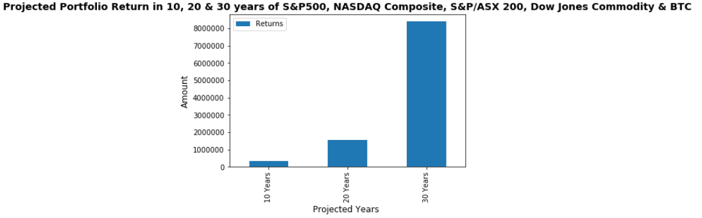

## Cost of Living Analysis:
___

